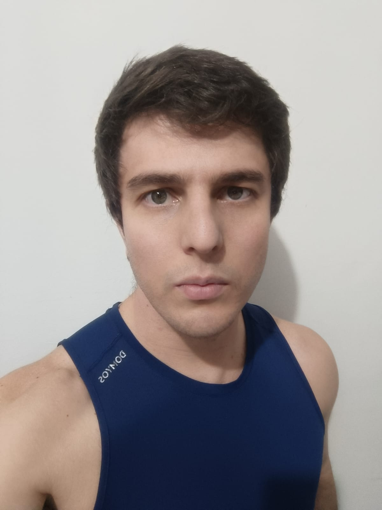

<h1 align="center">Natural ou Fake Natty? Como Vencer na Era das IAs Generativas</h1>

Olá pessoal, me chamo Allan Abner ! Inspirado na hype _"Natty or Not"_ do fisiculturismo, este Lab da DIO  é baseado no mundo das IAs Generativas, explorando o potencial dessas tendências tecnológicas incríveis! 

**Explorando as IAs Generativas**: Utilizei essas tecnologias para criar um vídeo fazendo uma breve descrição do modelo de treinamento ISOTON RUSSO. Criei um Avatar meu no heygen utilizando uma foto que já tinha e também criei um áudio a partir de um texto que digitei no Wavel.AI. 

## 💻 Projeto

Vídeo - Natural ou Fake Natty? Como Vencer na Era das IAs Generativas  

## 🚀 Tecnologias utilizadas no projeto

Esse projeto foi desenvolvido com as seguintes tecnologias:

- [ChatGPT](https://chat.openai.com/)  
- [Wavel](https://studio.wavel.ai/)  
- [Heygen](https://app.heygen.com/)  

## ✨ Como foi feito ?

- Roteiro criado por mim
- Roteiro corrigido via chatgpt
- Audio gerado pela Wavel
- Avatar e vídeo criados com o heygen, a partir de uma foto minha e do áudio produzido no wavel.ai

## 🔖 Layout

Você pode visualizar a descrição do desafio deste projeto através [DESSE LINK](https://github.com/digitalinnovationone/lab-natty-or-not). 
  

## Expert

<a href="https://www.linkedin.com/in/allanabner/">LinkedIn</a>&nbsp;|&nbsp;

⌨️ com 💜 por [Allan Abner](https://github.com/AllanAbner)

  
